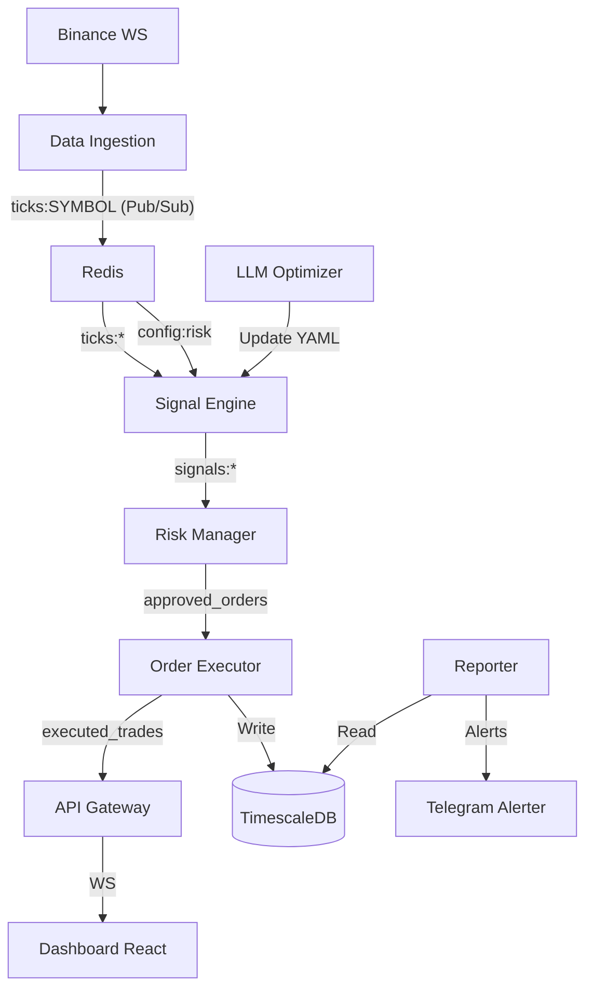

# Technical Audit & Code Review: CryptoTraderJules

## 1. Executive Summary

**Progetto:** CryptoTraderJules (CryptoScalper Pro)  
**Stack Tecnologico:** Python (FastAPI, Asyncio), Redis, TimescaleDB, Docker, React (Frontend).  
**Obiettivo:** Trading bot ad alta frequenza con supporto per A/B testing e ottimizzazione tramite LLM.

### Valutazione Generale
Il progetto presenta un'architettura a microservizi moderna e ben strutturata, con una chiara separazione delle responsabilità (ingestion, signal, risk, execution). Tuttavia, sono presenti criticità strutturali legate alla **gestione dello stato in memoria** e alla **sicurezza delle comunicazioni** che potrebbero compromettere la stabilità e l'integrità del capitale in produzione.

### Livello Qualitativo: **Medio-Alto (Architetturale)** / **Medio (Implementativo)**

| Area | Valutazione | Rischio |
| :--- | :--- | :--- |
| **Architettura** | Eccellente | Basso |
| **Affidabilità** | Media | **Critico** (Perdita stato) |
| **Sicurezza** | Bassa | Alto (Segreti/WS) |
| **Performance** | Alta | Medio (Chattiness Redis) |
| **Manutenibilità** | Medio-Alta | Medio (Incoerenze Config) |

**Priorità di Intervento:**
1. **Critica:** Persistenza dello stato delle posizioni aperte (Risk/Order Executor).
2. **Alta:** Autenticazione WebSockets e hardening JWT.
3. **Alta:** Allineamento tra `config.yaml` e le classi di strategia implementate.
4. **Media:** Implementazione di un vero indicatore EMA e throttling dell'ingestion.

---

## 2. Mappa del Progetto



### Moduli Principali
- **`data_ingestion`**: Consumatore WebSocket Binance.
- **`signal_engine`**: Motore multi-strategia con supporto A/B.
- **`risk_manager`**: Validatore di segnali e circuit breaker.
- **`order_executor`**: Motore di esecuzione (Paper Trading implementato).
- **`llm_optimizer`**: Agente autonomo che ottimizza i parametri tramite Llama 3.
- **`api_gateway`**: Punto di accesso centralizzato per il frontend.

---

## 3. Analisi Architetturale

### Punti di Forza
- **Separazione delle Responsabilità:** Ogni servizio ha un compito ben definito, facilitando lo scaling orizzontale.
- **Event-Driven:** L'uso di Redis Pub/Sub permette una latenza minima tra la ricezione del tick e la generazione del segnale.
- **TimescaleDB:** Scelta eccellente per dati time-series (trade history), garantendo query performanti.

### Criticità
- **Accoppiamento Temporale (Stato In-Memory):** Molti servizi (`risk_manager`, `order_executor`) mantengono le posizioni aperte in dizionari Python (`self.open_positions`). In caso di crash del container, il bot "dimentica" di avere posizioni attive, portando a scenari di mancata chiusura (SL/TP non eseguiti).
- **Mancanza di una 'Source of Truth' per lo Stato:** Lo stato globale dovrebbe essere sincronizzato su Redis (Hash) o DB per permettere il riavvio dei microservizi senza perdita di contesto.

---

## 4. Analisi del Codice

### `signal_engine/strategy.py`
- **Problema:** `EMAStrategy` implementa una Media Mobile Semplice (SMA) invece di una Media Mobile Esponenziale (EMA).
- **Problema:** Incoerenza Naming. Il file `config.yaml` fa riferimento a `EmaCrossoverStrategy`, mentre la classe si chiama `EMAStrategy`.
- **Esempio Inefficiente:**
  ```python
  prices = list(context.price_history)[-self.slow_period:] # Conversione deque->list ad ogni tick
  ```

### `data_ingestion/main.py`
- **Problema:** Elevata verbosità. Il servizio pubblica su Redis ad ogni singolo update del `bookTicker` e `trade`. In mercati volatili, questo può generare migliaia di messaggi al secondo, saturando il thread di asyncio.
- **Consiglio:** Throttling (es. max 1 update ogni 100ms per simbolo se non ci sono variazioni significative di prezzo).

### `llm_optimizer/main.py`
- **Rischio Logico:** L'LLM sovrascrive direttamente il file `config.yaml`. Se l'output non è conforme (es. nomi strategie errati), il `signal_engine` fallisce al reload.
- **Codice Morto/Incompleto:** `VWAPDeviationStrategy` è presente nel config ma non implementata nel codice.

---

## 5. Sicurezza

| Severità | Problema | Descrizione |
| :--- | :--- | :--- |
| **CRITICO** | **Hardcoded JWT Secret** | `SECRET_KEY` in `api_gateway/main.py` ha un default non sicuro. |
| **ALTO** | **Unauthenticated WS** | Il WebSocket `/ws/live` accetta connessioni senza token, esponendo flussi di trading in tempo reale. |
| **ALTO** | **Config Injection** | L'LLM può iniettare parametri arbitrari nel config se non validati tramite schema (Pydantic). |
| **MEDIO** | **CORS Permissivo** | `allow_origins=["*"]` o localhost fisso senza configurazione dinamica. |

---

## 6. Performance

- **Query Inefficienti:** In `reporter/main.py`, il caricamento di tutti i trade giornalieri in memoria per calcolare le statistiche potrebbe fallire con volumi elevati (>100k trade/giorno). Utilizzare aggregazioni SQL (`AVG`, `SUM`, `STDDEV`) direttamente in TimescaleDB.
- **Redis Overhead:** L'assenza di compressione o binning dei tick aumenta il carico sulla rete Docker.

---

## 7. DevOps e Deployment

- **Docker:** Configurazione solida con `depends_on` e healthchecks.
- **Logging:** Ottimo l'uso di `pythonjsonlogger` per log strutturati, essenziali per il monitoraggio.
- **Mancanza:** Non sono presenti file di CI/CD (GitHub Actions/GitLab CI) per il testing automatico.

---

## 8. Testing

- **Stato Attuale:** Quasi inesistente. Presente solo un `test_alerter.py`.
- **Criticità:** Un trading bot richiede Unit Test rigorosi sulle strategie e Integration Test (Backtesting) per validare la logica di esecuzione.
- **Strategia Consigliata:** Implementare test per la logica di `Consensus` in `SignalEngine`.

---

## 9. Refactoring Prioritario (Roadmap)

| Priorità | Problema | Impatto | Difficoltà | Azione |
| :---: | :--- | :---: | :---: | :--- |
| **1** | Persistenza Posizioni | Critico | Media | Spostare `open_positions` su Redis Hash. |
| **2** | Auth WebSocket | Alto | Bassa | Aggiungere dependency `get_current_user` al WS. |
| **3** | Schema Config | Alto | Media | Usare Pydantic per validare il YAML prodotto dall'LLM. |
| **4** | Fix EMA | Medio | Bassa | Implementare formula EMA corretta (moltiplicatore). |
| **5** | SQL Aggregations | Medio | Media | Spostare calcoli PnL dal Python al DB. |

---

## 10. Score Finale

| Categoria | Punteggio |
| :--- | :---: |
| Architettura | 85/100 |
| Sicurezza | 40/100 |
| Performance | 75/100 |
| Manutenibilità | 65/100 |
| Qualità Codice | 70/100 |
| Testing | 10/100 |
| Documentazione | 60/100 |
| **VOTO FINALE** | **58/100** |

---

## Extra

### "Quick Wins" (Miglioramenti Immediati)
1. **Protezione JWT:** Spostare il segreto in una variabile d'ambiente obbligatoria.
2. **Validazione YAML:** Aggiungere un controllo `isinstance(cfg, dict)` prima del reload.
3. **Throttling Ingestion:** Limitare la frequenza di `publish_tick` a 50ms.

### Technical Debt Index
- **Debito Tecnico:** Alto (causato dallo stato volatile).
- **Rischio Evolutivo:** Medio-Alto (le discrepanze config-code rendono difficile aggiungere nuove strategie).
- **Sostenibilità:** Buona se viene risolto il problema della persistenza.

### Top 10 Problemi Critici
1. **Stato Volatile Risk Manager:** Perdita posizioni al riavvio.
2. **Stato Volatile Order Executor:** Perdita ordini al riavvio.
3. **WebSocket Pubblico:** Chiunque può leggere i segnali di trading.
4. **JWT Hardcoded:** Vulnerabilità di bypass autenticazione.
5. **EMA Fake:** Strategia basata su SMA spacciata per EMA.
6. **LLM Hallucination Risk:** Sovrascrittura config con nomi errati.
7. **Discrepanza Config-Code:** Strategia `VWAP` mancante.
8. **Redis Flood:** Mancanza di throttling nell'ingestion.
9. **No Regression Tests:** Rischio elevato a ogni modifica del motore di segnale.
10. **Hardcoded DB Credentials:** Presenti default nel codice e `docker-compose.yml`.

---
*Analisi prodotta da Senior Software Architect AI.*
